<!-- @format -->

# AndroidJava

JavaCodes are in file path
:app/src/androidTest/java/redeem/androidjava

This app was created as intent to get the offline documention of android and java,
in hand and all the information inside the apps's database is scrapped from the official
website of the google .

All the content is store in the compressed database file which app,
decompresses each time we open the file for the first time.
And stays in the device memory.

## Search Features:

The search feature is just the sql search from table directly,
to reduce the overhead I limited the maximum list to 10, hence creating
the breakpoint of search to 10.

## Dark Mode:

Dark mode is accomplish either by the time reaching beyond 6 at evening and 6 at morning,
or overridden by the night_dark toggle at main activity.

# Extra

After some time,I found need of documentation for
other languages too. So I wrote a scrapper for
CPP which scrapes data from [cppreference.com](https://en.cppreference.com/).
App scrapes data on fly and stores the once collected data in SQL database of device memory.

## ScreenShots

Some screen shots of the application
&emsp;

  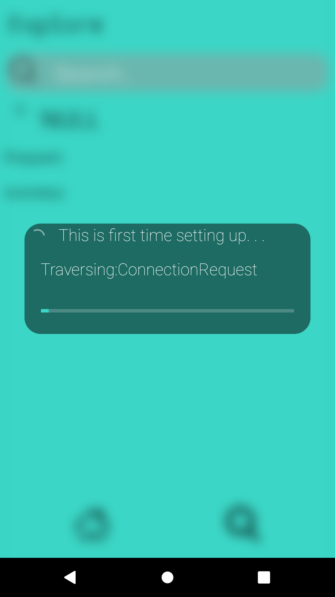
  &emsp;

  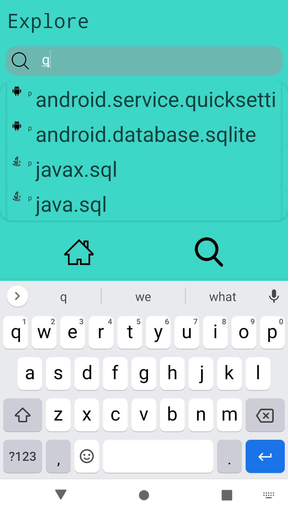 
  &emsp;

  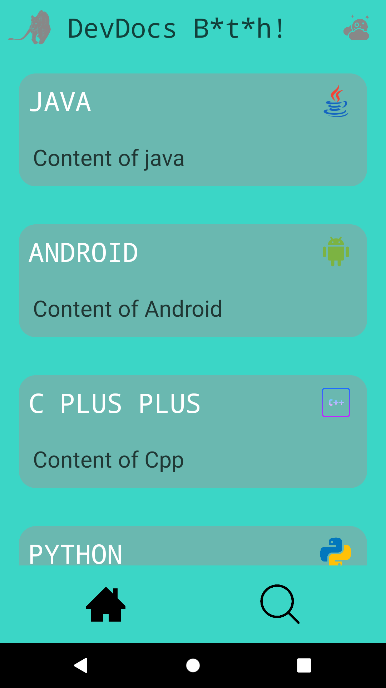

  &emsp;

  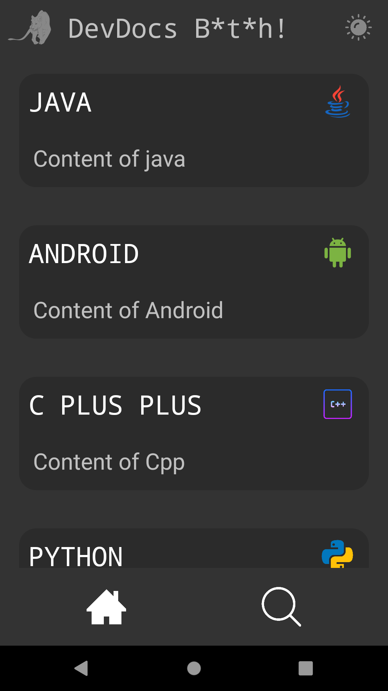
  &emsp;

  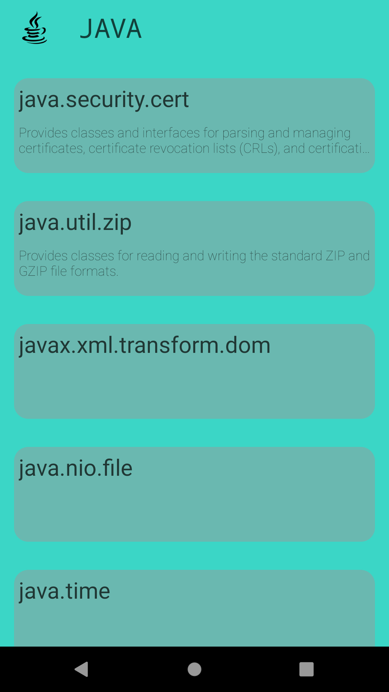 
  &emsp;

  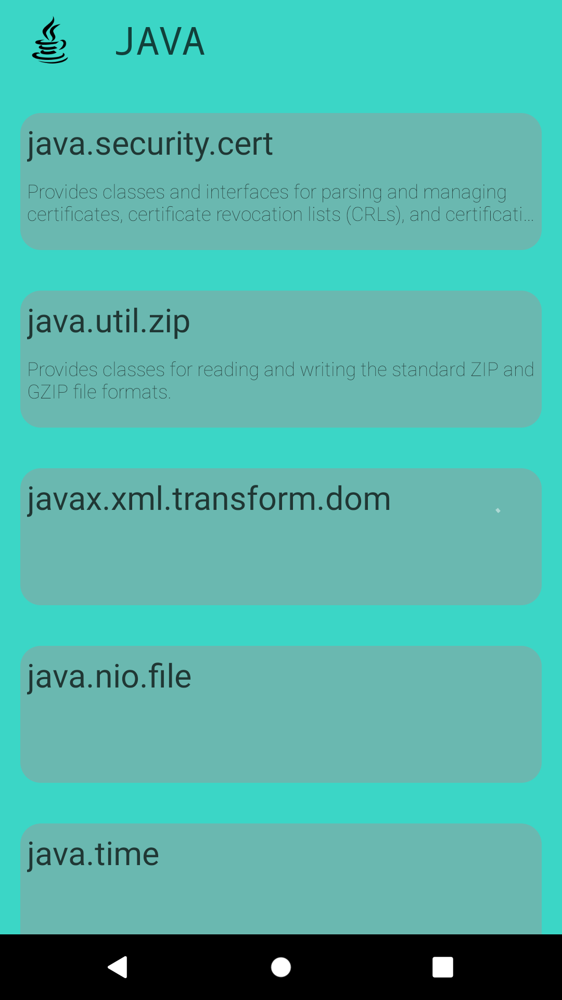

  &emsp;

  
  &emsp;

   
  &emsp;

  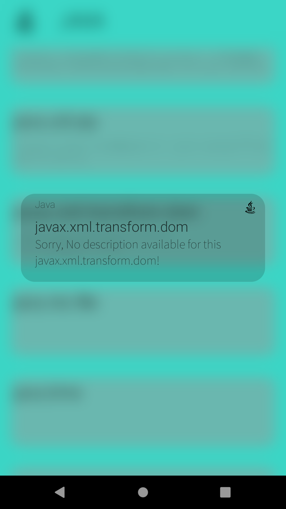

  &emsp;

  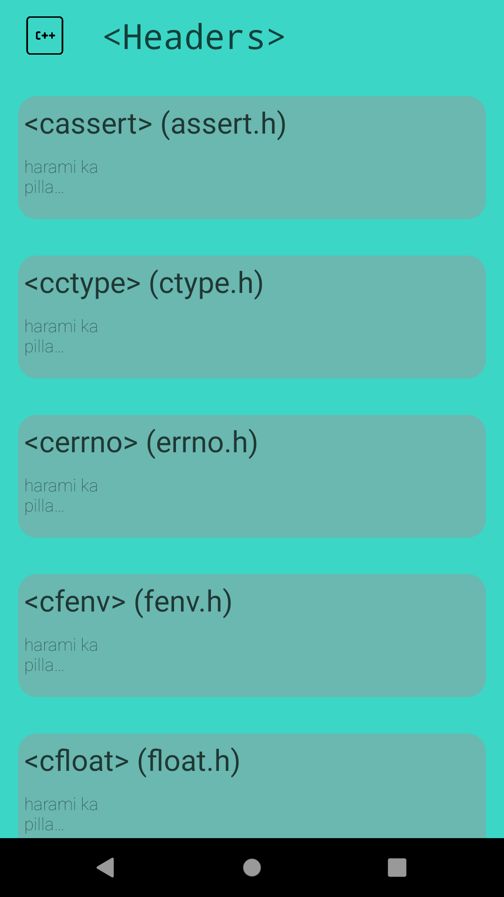
  &emsp;

  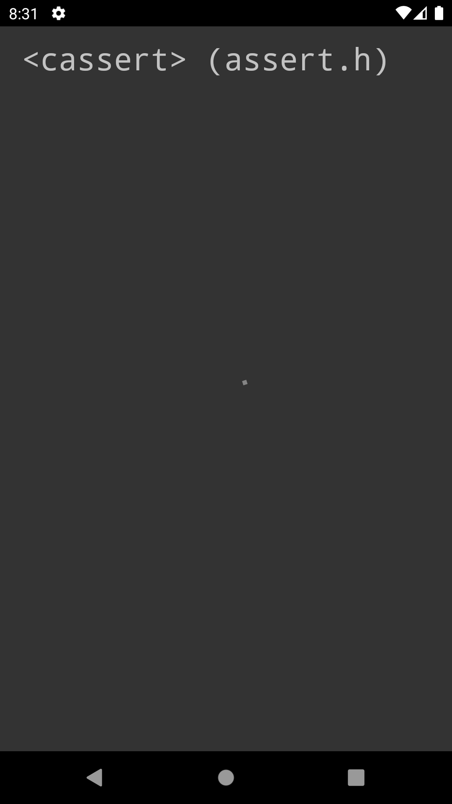 
  &emsp;

  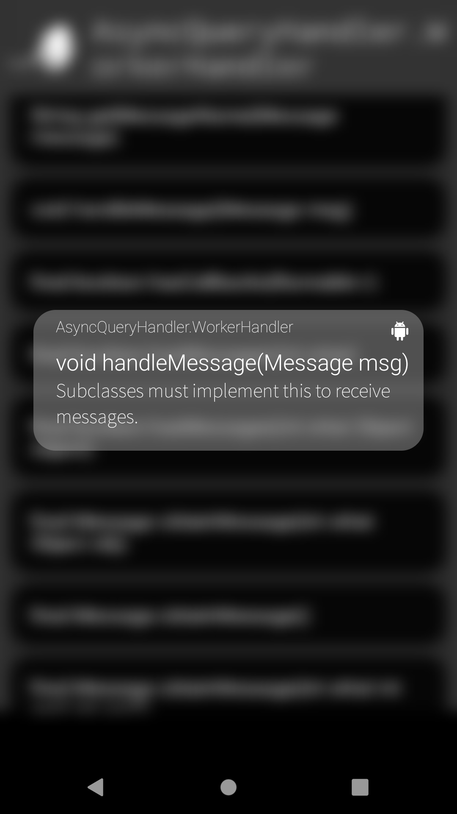

## Code Snaps

  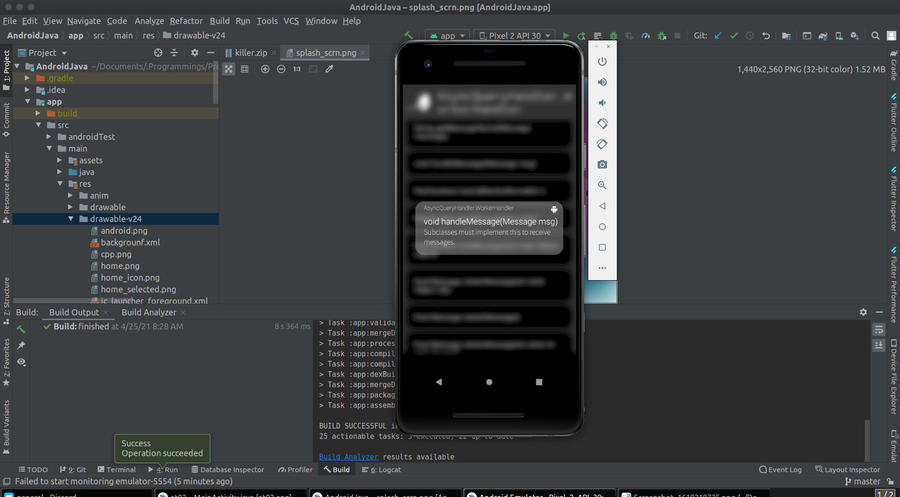
  &emsp;
  &emsp;
  &emsp;
  &emsp;

  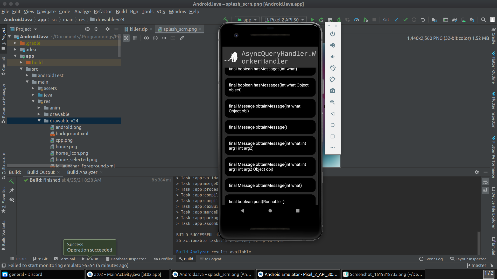

  &emsp;

  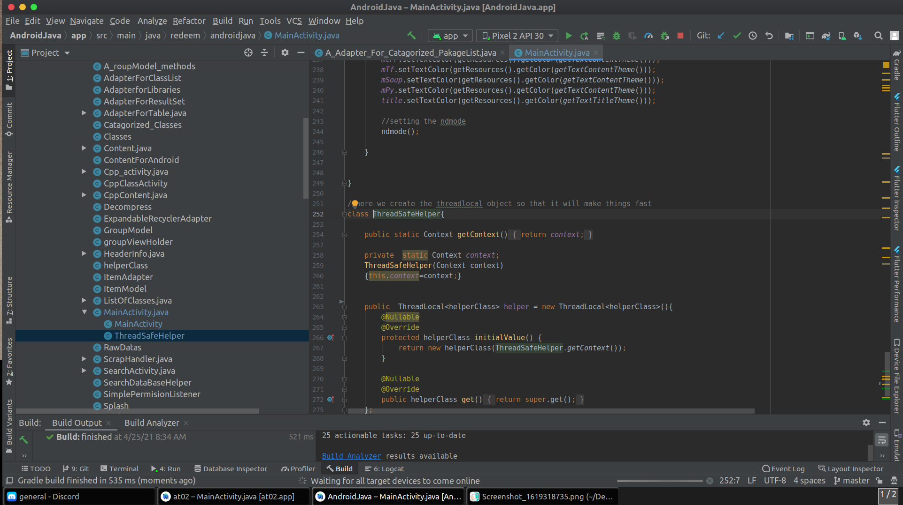
   &emsp;
  &emsp;
  &emsp;
  &emsp;

  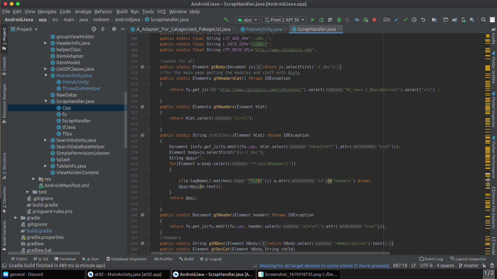

